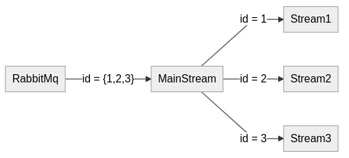
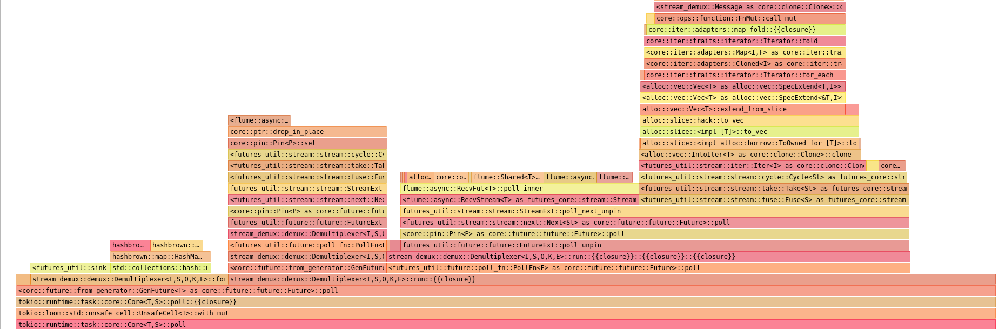
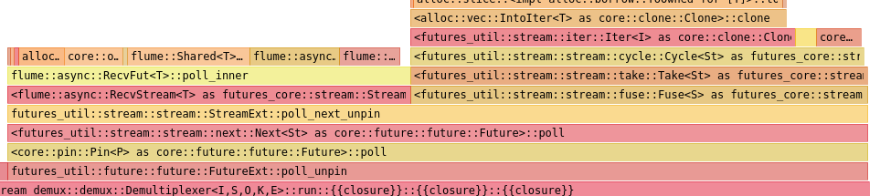
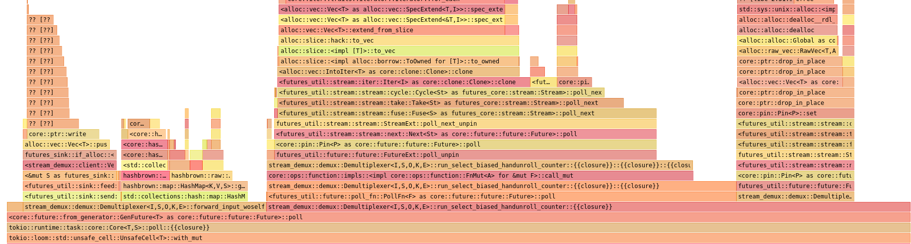

+++
title = "Demultiplexing Streams in Rust"
date = 2021-01-23
+++

### Problem

I am working on message stream processing software.

This is a small Rust application that has to perform two tasks :
* demultiplex stream of RabbitMq messages to many clients connected via WebSocket
* apply rate limiting to each demultiplexed stream dropping messages that exceed the limit

While reading messages from RabbitMq as a stream can be easily done using [Lapin](https://github.com/CleverCloud/lapin), task of demultiplexing them to multiple clients in an efficient way is something that does not seem oficially supported by `Streams`, nor there is a library available to handle it for me in a way I need.

Therefore a problem to solve is how to demultiplex `Stream` into multiple `Streams` based on some message properties (in this particular case message headers). Problem of applying rate limitation will not be described in this post.

As one picture is worth a thousand words, here's a graph depicting my desired workflow:



It is important to note that implementation needs to be able to dynamically accepts new orders and modify number of resulting `Streams`.

Other relevant note is that not all messages from main stream need to be rerouted. If there is no "job" that given message matches, the message should be dropped.

### Available libraries

The only library I found that deals with demultiplexing (and multiplexing) is [mux-stream](https://github.com/Hirrolot/mux-stream).
Unfortunately, it seems to only support static (aka known at compile time) demultiplexing. I want to be able to add new `Streams` to my demultiplexer dynamically. Therefore I need my own implementation.

### The Demultiplexer

While implementing demultiplexer I tried to stay as generic as possible, that is why there are so many generic type constraints.

```rust
pub struct Demultiplexer<I, S, O, K, E> {
    input: I,
    sinks: HashMap<K, S>,
    orders: O,
    error_handler: E,
}

pub trait Identifiable {
    type Id;
    fn id<'a>(&'a self) -> &'a Self::Id;
}

impl<I, S, O, K, V, E> Demultiplexer<I, S, O, K, E>
where
    I: Stream<Item = V> + Unpin + FusedStream,
    K: Eq + Hash,
    V: Identifiable<Id = K>,
    S: Sink<V> + Unpin,
    O: Stream<Item = (K, S)> + Unpin + FusedStream,
    E: FnMut(<S as Sink<V>>::Error),
{
    pub async fn run(mut self) {
        /* 
            omitted for now
            event loop goes here
        */
    }
}
```

All those generic parameters correspond to one functionality of `Demultiplexer`.
Starting from the top:
* `I` is an input stream, a stream that that has to be demultiplexed into different sinks
* `K` is a type of a key in `HashMap` that stores sinks
* `V` is a value that is being passed in by input stream
* `S` is a sink for demultiplexed values
* `O` is a stream of orders that are dynamically added to active sinks
* `E` is an error handler for errors that might arise while writing to sink

One trait `Identifiable` is also introduced to allow identification of message of type `V` in `Demultiplexer`. I've not found any suitable trait from standard library, but I did not bother much to do it either.

Notable difference between my dream implementation and one presented above is usage of `Sinks` instead of `Streams` as output method. Why is that?
While trying to expose a collection of `Streams` from `Demultiplexer` I ran into issues with nature of `Streams`.

`Streams` can be polled, so to write to it, you need to have a writing part - and that is exactly abstraction `Sink` provides. Also, when stream uses waker to inform executor that new message is available, so that it can poll it, it wakes up entire task. If all produced `Streams` operated as a part of one task, all would be polled, but only one would receive message. I do not know if it is possible and even if it was, it would be inefficient.

Soultion is to make `Demultiplexer` into kind of event loop that polls main stream and writes messages to appropriate buffers represented by `Sinks` (and possibly other executor tasks). Having an event loop also allows for accepting new orders, thus dynamically adding new outputs from a `Stream`.

It makes my implemntation similar to [`forward`](https://docs.rs/futures/0.3.12/futures/stream/trait.StreamExt.html#method.forward) function from `StreamExt`

### Demultiplexing

To handle both new messages from input stream and new orders, I need `Demultiplexer` to run in a loop checking for new messages and orders. At least I hope that I have to, since I did not come up with any better idea. I was hoping to make this component less self aware and composable with other `Stream`, but I did not succeed in it.

Having said that, my implementation works fine, but is not as perfect as I wanted to be.

In Rust we have couple of ways to poll multiple `Streams` concurrently (mind that not in parallel!):
* `FuturesUnordered` - I did not dig into this one this much for two reasons. First, I is used with `Futures`, second, `SelectAll` actually uses it under the hood.
* `SelectAll` - it promises to poll multiple streams concurrently. It can be built either with `select_all` function or manually, pushing all streams one by one. It requires that all streams are of the same type. It can be hacked a bit to accept stream of multiple types, but it comes at a cost. I'll write more details about it later.
* `select!` - a macro that expands into code that polls a known number of `Streams` or `Futures` and executes "callbacks" that were passed in. Stream are polled in random order that changes with every poll.
* `select_biased!` - similar to `select!`, but polls `Streams` in order of declaration.

My goal in next paragraphs is to examine all those techniques and select the one that is both easiest to write and fastest to perform in runtime.

#### select!

To run even loop with `select!` I need to put all code in a loop and the use macro.

Its syntax is:
```rust
select!
{
    variable = stream-to-await => {
        "callback" that can use variable
    }  
}    
```

And putting it in action:

```rust
pub async fn run(mut self) {
    loop {
        select! {
            input = self.input.next() => {
                match input {
                    Some(input) => self.forward_input(input).await,
                    None => {
                        break;
                    }
                }
            },
            order = self.orders.next() => {
                if let Some(order) = order {
                    self.sinks.insert(order.0, order.1);
                }
            },
            complete => break,
        }
    }
}
```

It is very simple, on new input message I simply forward it to all sinks with `forward_input` function. When input stream is finished I break event loop as it will no longer be useful.

When new order arrives I just push new `Sink` into set of available `Sinks` keyed under id it is associated with.

Macro accepts also `complete` and `default` branches that handle cases when, respectively, all streams are finished and none of them is.

Function to forward input is short, split in two so that other implementation with `SelectAll` can use it.

```rust
async fn forward_input(&mut self, element: V) {
    Self::forward_input_woself(&mut self.sinks, &mut self.error_handler, element).await;
}

async fn forward_input_woself(sinks: &mut HashMap<K, S>, error_handler: &mut E, element: V) {
    let id = element.id();
    if let Some(sink) = sinks.get_mut(id) {
        let send_result = sink.send(element).await;
        if let Err(e) = send_result {
            (error_handler)(e);
        }
    }
}
```

#### select_biased!

Implementation is identical, only change is macro's name. It is worth noting that order's are polled first. This is due to the fact that input stream is always ready in my test app, so to poll orders, I need to poll it first. It might have some implications discussed in further sections.

```rust
pub async fn run(mut self) {
    loop {
        select_biased! {
            order = self.orders.next() => {
                if let Some(order) = order {
                    self.sinks.insert(order.0, order.1);
                }
            },
            input = self.input.next() => {
                match input {
                    Some(input) => self.forward_input(input).await,
                    None => {
                        break;
                    }
                }
            },
            complete => break,
        }
    }
}
```

#### SelectAll

This is where things start to get interesting.
Using `SelectAll` requires to put more constraints on `Demultiplexer` impl block, namely adding `Send` constraint on two types types.

```rust
impl<I, S, O, K, V, E> Demultiplexer<I, S, O, K, E>
where
    I: Stream<Item = V> + Unpin + FusedStream + Send, // here
    K: Eq + Hash,
    V: Identifiable<Id = K>,
    S: Sink<V> + Unpin,
    O: Stream<Item = (K, S)> + Unpin + FusedStream + Send, // and here
    E: FnMut(<S as Sink<V>>::Error),
```

Issue with `SelectAll` is that while polling streams it has registered, it does not end entire flow if only one of `Streams` end. It is a major problem as `Demultiplexer` just has to finish its operations when input `Stream` is done. To overcome this problem I used ancient method of code reuse - copy-paste from `futures` crate with necessary tweaks. You can look the code up in there, in version 0.3.12. I'll only show here code I changed, that is `Stream` implementation for my `SelectAllCustom`.

Code that is commented out is the exact code that was breaking my application.

```rust
impl<St: Stream + Unpin> Stream for SelectAllCustom<St> {
    type Item = St::Item;

    fn poll_next(mut self: Pin<&mut Self>, cx: &mut Context<'_>) -> Poll<Option<Self::Item>> {
        loop {
            match ready!(self.inner.poll_next_unpin(cx)) {
                Some((Some(item), remaining)) => {
                    self.push(remaining);
                    return Poll::Ready(Some(item));
                }
                // Some((None, _)) => {
                //     // `FuturesUnordered` thinks it isn't terminated
                //     // because it yielded a Some.
                //     // We do not return, but poll `FuturesUnordered`
                //     // in the next loop iteration.
                // }
                _ => return Poll::Ready(None),
            }
        }
    }
}
```

Knowing that, here's `Demultiplexer` implementation using it.

```rust
enum DemuxTask<V, K, S> {
    Order((K, S)),
    Input(V),
}

pub async fn run(mut self) {
    let orders = self.orders.map(|o| DemuxTask::<V, K, S>::Order(o));
    let input = self.input.map(|v| DemuxTask::<V, K, S>::Input(v));
    let mut tasks: SelectAllCustom<Box<dyn Stream<Item = DemuxTask<V, K, S>> + Unpin + Send>> =
        SelectAllCustom::new();
    tasks.push(Box::new(orders));
    tasks.push(Box::new(input));
    loop {
        match tasks.next().await {
            Some(DemuxTask::Order((key, sink))) => {
                self.sinks.insert(key, sink);
            }
            Some(DemuxTask::Input(input)) => {
                Self::forward_input_woself(&mut self.sinks, &mut self.error_handler, input)
                    .await
            }
            None => break,
        }
    }
}
```

Hack to actually make `SelectAll` work with different types of `Streams` is to explicitly specify `SelectAll` type to `SelectAllCustom<Box<dyn Stream<Item = DemuxTask<V, K, S>> + Unpin + Send>>` and create an enum to accomodate both message types - `DemuxTask`. It works, but has some additional cost related to `Stream` transformations with `map` and also with boxing `Streams`, however I am not sure how it is handled later by `SelectAll` implementation.

### Ease of use

Regarding ease of use versions of `Demultiplexer` using `select*` macros are clear winners. `SelectAll` is not only clumsier to use, but to work it also requires copy pasting code, unless there is a way to make library version do what I want it to.

### Performance

To test performance of `Demultiplexer` I need a test application and a profiler or benchmark tool. Let's start with the first one.

I am using `tokio` as async runtime and `flume` as my channels library. Application defines `Message` type and creates 100_000_000 messages with 3 distinct ids. I am using single-threaded runtime as it was actually faster than multithreaded one in this small application, probably due to startup and teardown costs. It does not matter that much actually, as long as all tests are executed in same environment. I should have probably test all functions in multithreaded runtime as well, as performance is a tricky beast, but to keep this post more focused, I decided not to.

```rust
mod client;
mod demux;
mod select_all;

use client::*;
use demux::*;
use futures::{stream, StreamExt};
use std::fmt::Display;

fn main() {
    let rt = tokio::runtime::Builder::new_current_thread()
        .build()
        .unwrap();

    rt.block_on(tokio_main());
}

async fn tokio_main() {
    let messages = vec![
        Message {
            id: 1,
            word: "one".into(),
        },
        Message {
            id: 2,
            word: "two".into(),
        },
        Message {
            id: 3,
            word: "three".into(),
        },
    ];

    let take = 100_000_000;

    let values = stream::iter(messages).cycle().take(take).fuse();

    let (os, or) = flume::unbounded::<(i32, VecWrapperClient<Message>)>();

    let dmux = Demultiplexer::new(values, or.into_stream(), |e| {
        println!("Error while sending in demux : {}", e);
    });

    os.send((1, VecWrapperClient::new(1, take / 3 + 10))).unwrap();
    os.send((2, VecWrapperClient::new(2, take / 3 + 10))).unwrap();
    os.send((3, VecWrapperClient::new(3, take / 3 + 10))).unwrap();

    let _ = tokio::spawn(dmux.run()).await;

    println!("Application exiting")
}

#[derive(Debug, Clone)]
struct Message {
    id: i32,
    word: String,
}

impl Display for Message {
    fn fmt(&self, f: &mut std::fmt::Formatter<'_>) -> std::fmt::Result {
        write!(f, "{}", self.word)
    }
}

impl Identifiable for Message {
    type Id = i32;

    fn id<'a>(&'a self) -> &'a Self::Id {
        &self.id
    }
}
```

I hope you noticed `VecWrapperClient` type that certainly does not come from library. What is that? 
To test `Demultiplexer` I wanted to have cheap `Sink`. I could use flume's channels, but they are surpisingly expensive to use in my benchmarks, cluttering flamegraphs. Fortunately, I found that good old `Vec` implements `Sink`! I did not want to implement my own `Sink` as they are much more complex to implement than `Streams`. Therefore I created thin wrapper (in order to be able to implement custom `Drop`) on `Vec` and forwarded all `Sinks` functions to `Vec`'s implementation.

In real application `Sinks` should probably be senders of some channels to make it really functional, but for simple application like this that is mostly used for benchmarking and profiling, this should be enough.

```rust
pub struct VecWrapperClient<T>(i32, Vec<T>);

impl<T> VecWrapperClient<T> {
    pub fn new(id: i32, capacity: usize) -> Self {
        VecWrapperClient(id, Vec::with_capacity(capacity))
    }
}

impl<T> Deref for VecWrapperClient<T> {
    type Target = Vec<T>;

    fn deref(&self) -> &Self::Target {
        &self.1
    }
}

impl<T> DerefMut for VecWrapperClient<T> {
    fn deref_mut(&mut self) -> &mut Self::Target {
        &mut self.1
    }
}

impl<Item: Unpin> Sink<Item> for VecWrapperClient<Item> {
    type Error = <Vec<Item> as Sink<Item>>::Error;

    fn poll_ready(
        mut self: std::pin::Pin<&mut Self>,
        cx: &mut std::task::Context<'_>,
    ) -> std::task::Poll<Result<(), Self::Error>> {
        Pin::new(&mut self.1).poll_ready(cx)
    }

    fn start_send(mut self: std::pin::Pin<&mut Self>, item: Item) -> Result<(), Self::Error> {
        Pin::new(&mut self.1).start_send(item)
    }

    fn poll_flush(
        mut self: std::pin::Pin<&mut Self>,
        cx: &mut std::task::Context<'_>,
    ) -> std::task::Poll<Result<(), Self::Error>> {
        Pin::new(&mut self.1).poll_flush(cx)
    }

    fn poll_close(
        mut self: std::pin::Pin<&mut Self>,
        cx: &mut std::task::Context<'_>,
    ) -> std::task::Poll<Result<(), Self::Error>> {
        Pin::new(&mut self.1).poll_close(cx)
    }
}

impl<T> Drop for VecWrapperClient<T> {
    fn drop(&mut self) {
        println!("Vec client {} received {} messages", self.0, self.1.len());
    }
}
```

As a profiler I chose perf with [hotspot](https://github.com/KDAB/hotspot) to view recorded data. For preliminary examination I used `time` command from Linux.

My machine is using AMD Ryzen 5 3600 (Six core processor) with hyper-threading enabled. I have 16GB of RAM, operating system is Linux Mint 20.1. I am using rustc 1.49.0 (e1884a8e3 2020-12-29).

### Profiling

Simple results from time are (based on 5 runs average) presented below.

Implementation  | Time (s)
--------------- |----------
select!         | 15.8
select_biased!  | 15.8
SelectAllCustom | 22.1

Not so bad, but can we do better and how?

One simple optimization comes from [Rust Performance Book](https://nnethercote.github.io/perf-book/build-configuration.html) from chapter about build configurations. It says that we can help compiler produce better code at the cost of compilation time. I added following in my Cargo.toml:

```toml
[profile.release]
codegen-units = 1
lto = true
```

For details about what exactly are those flags imposing on compiler, please see Rust Performance book.

Results of this simple optimization are presented below:

Implementation  | Time (s)
--------------- |----------
select!         | 13.5
select_biased!  | 12.3
SelectAllCustom | 17.2

Quite nice! Having added 3 lines in Cargo.toml and waiting some more time for application to compile, I achieved non-negligible performance improvement!

Let's try actually profiling running application and see what it is doing to spot additional fields for improvement.
To make profiling possible some tweaks to release profile need to be applied to include debug symbols in release build. Final Cargo.toml section for release profile looks like this:

```toml
[profile.release]
codegen-units = 1
debug = 1
lto = true
```

Since analyzing application performance with profilers can be tedious and this blog post is already lengthy, I decided to only analyze already fastest version using `select_biased!`.

Using following perf command I collected trace of the application:
```
perf record --call-graph dwarf -o select_biased_vanilla.perf.data ./target/release/stream-demux
```

And later displayed a flamegraph using hotspot:



Since it is quite big and might not be visible on smaller screens, here's zoom into interesting section:



It clearly show that a lot of time is used polling `flume::async::RecvStream<T>`. Why? 

In my implementation, orders are delivered by flumes's async channel. And orders are always polled first, even though they arrive rarely. This is done for correctness reasons. Can we do anything about it?
Answer really depends on:
* characteristics of your application
* how desperate you are

I am polling orders first, since input is a `Stream` that is always ready. I tested what happens if I reverse polling order and performance increased significantly, but application no longers served its purpose as no message was delivered to appropriate `Sink` (hence `Drop` implementation on my `Sink` to report number of received messages).

If your application is under such a heavy load that you risk never polling orders as in my case, solution exists, but is not simple. In other cases, if you can afford loosing a few messages sometimes due to input being ready before orders for some time, you might want to revert order of polling in `select_biased`. You need to test it yourself, corectness in a priority, performance comes afterwards!

For those eager to learn what crazy things you can do to overcome this problem, below I present my solution. It only works correctly under assumption that your system is under extremely heavy load. Extremely. Heavy. Load. So heavy that input stream always has ready message. It is unlikely in real applications, because such streams usually come from some external resources that require network roundtrip to get information and thus leave some time for orders. In any way, measure first!

### Some dark magic

`select_biased` is fastest to execute, but has one irritating feature - it always polls the same stream first and we are unable to change it ... are we? It is a macro, so it expands to something. Why don't we see into what? To do this you can use [`cargo expand` subcommand](https://github.com/dtolnay/cargo-expand).

Code that it actually expands to is listed below. It is quite lenghty, that is the power of macros! I cleaned it a bit to make it more readable. Actual `cargo expand` will give you much uglier code.
```rust
pub async fn run(mut self) {
    loop {
        {
            enum PrivResult<_0, _1> {
                _0(_0),
                _1(_1),
                Complete,
            }
            let select_result = {
                let mut orders = self.orders.next();
                let mut input = self.input.next();
                let poll_fn = |__cx: &mut futures::task::Context<'_>| {
                    let mut any_polled = false;
                 let mut orders = |__cx: &mut futures::task::Context<'_>| {
                        let mut orders = unsafe { Pin::new_unchecked(&mut orders) };
                        if futures::future::FusedFuture::is_terminated(&orders) {
                            None
                        } else {
                            Some(
                                futures::future::FutureExt::poll_unpin(&mut orders, __cx)
                                    .map(PrivResult::_0),
                            )
                        }
                    };
                    let orders: &mut dyn FnMut(
                        &mut futures::task::Context<'_>,
                    )
                        -> Option<futures::task::Poll<_>> = &mut orders;
                 let mut input = |__cx: &mut futures::task::Context<'_>| {
                        let mut input = unsafe { Pin::new_unchecked(&mut input) };
                        if futures::future::FusedFuture::is_terminated(&input) {
                            None
                        } else {
                            Some(
                                futures::future::FutureExt::poll_unpin(&mut input, __cx)
                                    .map(PrivResult::_1),
                            )
                        }
                    };
                    let input: &mut dyn FnMut(
                        &mut futures::task::Context<'_>,
                    )
                        -> Option<futures::task::Poll<_>> = &mut input;
                 let mut select_arr = [orders, input];
                    for poller in &mut select_arr {
                        let poller: &mut &mut dyn FnMut(
                            &mut futures::task::Context<'_>,
                        )
                            -> Option<futures::task::Poll<_>> = poller;
                        match poller(__cx) {
                            Some(x @ futures::task::Poll::Ready(_)) => return x,
                            Some(futures::task::Poll::Pending) => {
                                any_polled = true;
                            }
                            None => {}
                        }
                    }
                    if !any_polled {
                        futures::task::Poll::Ready(PrivResult::Complete)
                    } else {
                        futures::task::Poll::Pending
                    }
                };
                futures::future::poll_fn(poll_fn).await
            };
            match select_result {
                PrivResult::_0(order) => {
                    if let Some(order) = order {
                        self.sinks.insert(order.0, order.1);
                    }
                }
                PrivResult::_1(input) => match input {
                    Some(input) => self.forward_input(input).await,
                    None => {
                        break;
                    }
                },
                PrivResult::Complete => break,
            }
        }
    }
```

Whooah! This is long! What it does is in essence, creating closures to poll each `Stream`, doing some on stack dynamic dispatch, creating array (`select_arr`) of those functions and later just calling it untill any succeeds (or none).
It is clearly visible that array is always in the same order. Could we tweak it a bit? Would it help? Let's try!

Idea is to count messages arriving in `Demultiplexer` and when they reach certain threshold, poll orders once and reset threshold. As I said, this only works almost correctly in systems that are under heavy load, that can afford tiny message loss and that do not receive many orders compared to number of messages.

To implement it I added a counter in run functions like this:
```rust
pub async fn run(mut self) {
    let mut counter = 0i32;
    loop { /* some code */ }
}
```

I also modified code constructing `select_arr` a bit. Rest of code is that same as on previous lisitng of macro expand.
```rust
let mut select_arr = if counter < 100 {
    counter += 1;
    [input, orders]
} else {
    counter = 0;
    [orders, input]
};
```

Running the program shows that result is almost correct. Less messages are delivered to sinks, but number of lost messages is extremely low compared to overall number. If this is acceptable depends on you and your application. In my case of my application it is not a problem.

Let's try it out with `time` first.

Implementation  | Time (s)
--------------- |----------
select_biased_custom!  | 9.6

Less than 10 seconds! Quite fast compared to other versions. At least loosing messages has attributed to some performance gains.

Analysis of perf data in hotspot also shows that code polling flume's Receiver is gone. It is invoked, but so little that it is not even shown on flamegraph.



I also tried to use timing to poll orders only sometimes, but using time is suprisingly (or not at all) expensive in such a tight loops. Maybe it would not matter in real application, but here flamegraph was ruthless.

The code probably can go faster, for example by implementing mechanism to store `Sinks` other than `HashMap` as flamegraph shows that storing it there is not as trivial as it might seem. However, this would be clearly overoptimization in most use cases ;). 

I hope you learnt something interesting from this lengthy blog post! The final part is probably premature optimization, but I had some fun doing it and it was clearly a development for me to investigate it!

### References

[Official Stream documentation.](https://docs.rs/futures/0.3.12/futures/prelude/trait.Stream.html)

[Official StreamExt documentation.](https://docs.rs/futures/0.3.12/futures/stream/trait.StreamExt.html)

[Download hotspot](https://github.com/KDAB/hotspot/releases) - version 1.3.0 (and NOT continuous build) have proper Rust symbol demangling

[Rust Performance Book](https://nnethercote.github.io/perf-book/title-page.html)